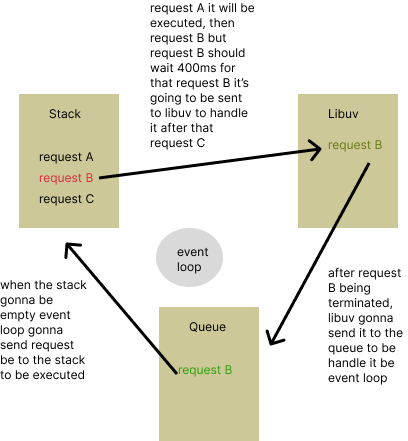
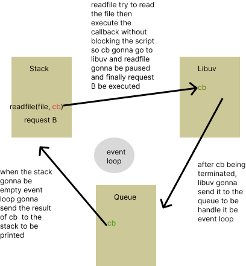
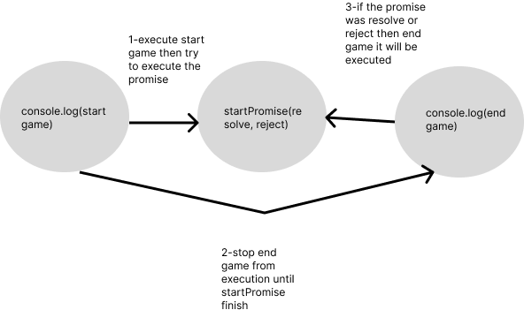

# explaining event loop and synchronization for dummies with code

## first scenario

let's say that we don't want our script to be blocked by `func()` and wait for it to be executed then execute the reset of the script. in this case we can use setTimeout to stop `func()` for 400ms then complete the execution(we guessed that `func()` goning to take about 400ms to be executed).

[code example here](timer.js)
## second scenario

be default node.js came with a rich api that supports both asynchronous and synchronous functions.
let's play with files using "fs" module and try to read the readme of this repo

- by using [readFileSync](blocking-action.js):
  we assure that reading action must to be synchronous so if there is a code after this call it should wait the `readFile` to be terminated
- by using [readFile](non-blocking-action.js):
  we should pass a callback `cb` to every asynchronous function in node to assure the execution.
  in our case node.js is not gonna wait readFile, it will console.log it after that it will show our results without respecting the order in the script.

## achieving synchronization by using promises and async/await

- the first example we used [Promises](promises.js) to make our code synchronize to respect the order of the execution of our game
- the second example we used [Async/await](async.js) to recreate the same behavior but with a different method

## golang async example

in this [example](async.go) i used goroutine with channels to make my function asynchronize
